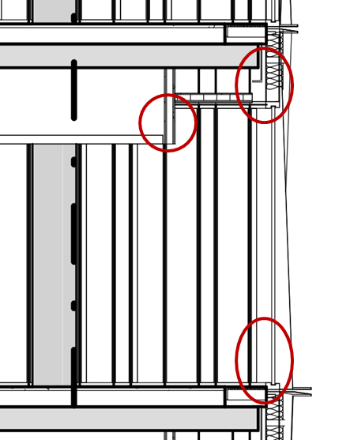

# Early design considerations

## Overview

Course 41936 Advanced Building Design is divided into multiple deliverables, part A to D, which can be regarded as implementations of a more general CDIO framework (Concieve, Design, innovate, Operate).

The job of an MEP is very multi-faceted, so sometimes it is beneficial to see the job boiled down to a simple recipe tailored for project work:

1.  Establish desired indoor climate with the client

2.  Determine necessary ranges of airflow rates for all involved rooms

    -   Min and max airflow rates are determined from air quality during light and heavy usage of the rooms

    -   If cooling is air-based, then max airflow is most probably determined by the peak cooling demand

3.  Use indoor climate simulations to determine cooling demand. Use passive design solutions to minimize active cooling.

4.  Sum airflows from all rooms and apply simultaneity factors. The further upstream you move, the lower the simultaneity factor can be

5.  Draft routing, determine duct sizes, air handling units. Iterate over the airflow ranges to ensure well-proportioned systems that operate in the 20-80% range of their capacity most of the time

6.  Determine total cooling demand and size chillers

7.  Determine heating demand and size heating system

8.  Document that energy demand and specific fan power are compliant with regulations.

## Early installation planning

In the early design phase we need to start listing **space requirements**, propose **building envelope** improvements and propose **installation routing.**

The functionality of the building relies on the installations and control strategies. While installations use physical space, the control strategies are very important for the final energy consumption of the building.

Installations to consider because they occupy significant physical space:

-   **Ventilation ducts**

    -   Intake, insulated against condensation

    -   Exhaust

    -   Supply, often insulated to ensure cooling for all rooms

    -   Return

-   **Air handling units**

    -   Location, basement/roof/tech floor

    -   Dimensions of AHU+connections+silencers

    -   Service space

    -   Weight, structural point load

    -   Fan efficiency for typical operation range

    -   Heat exchanger technology

-   **Heating pipes**

    -   Supply, insulated

    -   Return, insulated

    -   Mixing shunts to accommodate different supply temperature needs for different building sections (e.g. facades)

-   **Cooling pipes**

    -   Supply, insulated

    -   Return, insulated

    -   Mixing shunts to accommodate different supply temperature needs for different building sections (e.g. facades)

-   **Hot water pipes**

    -   Supply, insulated

    -   Circulation, insulated

    -   Location of hot water station with heat exchanger and pumps

-   **Cold water pipes**

    -   Pumping station to lift the water to the top floor

-   **Sewage**

    -   Location of downpipe

    -   Toilets connections to down pipe

-   **Drainage (from roof)**

    -   Rainwater

    -   Balconies

-   **Sprinklers**

    -   Sprinkling pipe

    -   Hose reel pipe

    -   Fire hose pipe

    -   Location of "fire station"

    -   Pipes to street connections

-   **Cables**

    -   Electricity for lighting, HVAC equipment and plugs

    -   IT-cabling

    -   Switch cabinets and service space around it

    -   Cable trays

## Early space planning

For space planning, **make a room program** that lists the design requirements of each type of space. Below you find suggested design info.

On the floor plans and final schematic deliverables, add the design info for every room: occupants, L/s, W, lux, °C etc.

-   **Space type**

    -   office, meeting, auditorium, multi-purpose room, lobby, student areas, corridors, toilets, copy room, cleaning equipment, depots/archive, tech rooms

-   **Occupant density**

    -   peak number from a judgment of number of seats in space as well as and expected reasonable occupancy (60-70-80%)

    -   occupants/m²

-   **Daylight criteria**

    -   Spatial Daylight Autonomy

-   **Thermal comfort range**

    -   Winter temperatures (where people have heavier clothing on)

    -   Summer temperatures (where people have lighter clothing on)

    -   Evaluated on operative temperatures (air+radiant)

-   **Temperature setpoints**

    -   Air temperatures are different from operative temperatures, setpoints should have an offset to thermal comfort temperatures

    -   Activates heating system

    -   Activates cooling system

-   **Airflow rate**

    -   Air supply rate, L/s per m²

    -   Return air supply rate, L/s per m²

-   **Lighting**

    -   Target lux level

    -   Installed power W/m²

-   **Heating system and devices**

    -   Design heating capacity W/m²

    -   Radiators or radiant ceiling, connected to heating loop

    -   Design supply and return temperatures

-   **Passive cooling system and devices, if any**

    -   Automatic window opening (day and/or night)

    -   Mechanical night ventilation to cool structure

    -   Ceiling fans to offset discomfort

-   **Active cooling system and device**

    -   Design cooling capacity W/m²

    -   Fan coils, active beams, chilled ceiling

    -   Design supply and return temperatures

-   **Shading strategy**

    -   Movable devices to reduce solar gain, often external and sometimes automatic

    -   Screens to protect from glare, often internal and manual

    -   External fixed shades like overhang and sidefins, parametrically optimized to minimize solar gains and maximize daylight

Figure 1. Slender floor plan with short distance to façade. Lounge area in center with bigger windows for airy feeling means there are no interior dark spaces

## Early daylight design

Achieve good daylight conditions without too much risk of overheating. This involves proposing a modular facade design, where opaque and transparent parts can be changed to accommodate for specific daylight in the space behind the façade.

The priority is to have sufficient daylit on permanent workstations using the window area sensibly. This makes the best indoor environment and lowest energy. You get the most daylight for the installed window area by choosing high windows with a view to the zenith, avoid transparent parts below desktop height, and by distributing them uniformly.

Save the use of big windows to specific locations where the effect is indeed big, e.g. at the end of corridors to make them feel more airy, in lounge areas where you want to have better view of the horizon, when exiting the elevator as a wauv effect and similar.

Figure 2. Daylight autonomy with and without internal walls. Daylight from multiple sides strongly enhances the daylight levels. Single offices placed on lower levels and open offices placed on upper levels exploits the available daylight maximally

Figure 3. Location of workstations and corridor determines the relevant area for daylight evaluation. In IDA ICE the left situation requires an additional measurement plane to be inserted. Source: Realdania (2025)

To summarize:

*2 m² of window in two configurations, corresponding to 16% window to floor ratio*

*Share of 0.85 m plane with >300 lux for >50% of daylight hours. Requirement is >50%*

Figure 4. Window above 0.85 m contributes more than window below. The horizontal window provides more uniform daylight level inside. It is clear that windows towards South may be reduced, achieving required daylight exposure and lower cooling demand. Source: Realdania (2025)

*[VERIFY: table caption in source document — "Table 2. Option 1: energy frame compliant calculation with local chiller" — appears misattached to this figure pair; check against original.]*

Figure 5. Good façade daylight design that exploits the zenith light: Avoid facade beams above windows and introduce beveled suspended ceiling to allow for high windows. Avoid windows to the floor as this adds very little daylight, but adds heating and cooling demand.

## Early indoor climate spefications

For super-fast, early specifications of the indoor climate requirements, and assuming a "normal" commercial building, for occupant activity of 1.2 Met and assuming that people can adapt their clothing level, you can use the following which will align well with the legislation (Building Code):

-   Thermal comfort: **21-26 °C**. Aim for \< 23 °C in winter and \> 23 °C in summer. This aligns well with EN16798 category II.

-   Ventilation rate due to air quality (CO2): **10 l/s per person**. This will align well with EN16798 category II.

-   Spatial daylight autonomy of **300 lux** in 50% of the space for 50% of the daylight hours (2190 h). This will align well with EN17037 category III. Specify internal manual screen/curtain for glare protection.

-   General artificial lighting level of **300 lux**.

## Guiding questions for concluding early design phase

-   Do you meet **daylight criteria** where necessary? Permanent workstations have specific daylight requirements. But all other spaces and student areas still want daylight and a view out and daylight also saves electrical lighting

-   Did you plan how to **ventilate all rooms**? Do you have proposals for vertical and horizontal routing paths in place? Did you plan the ventilation path from outside to the air handling unit and onwards to each room, and back?

-   Did you reduce the **heat loss** of the building envelope (insulation and better windows)?

-   Did you consider how to **reduce solar gains passively**: e.g. by replacing transparent façade parts with opaque parts where needed, by using external fixed shades to block high solar elevations, by using solar-coated glazings

-   Did you consider if **passive cooling methods** could reduce the mechanical cooling load? Did you consider that different space types benefit from different methods -- automatic window opening works well in spaces with lenient draught requirements, but not so well in auditoriums. Automatic external shading is costly and should be used sparingly.

-   Can you **heat** all rooms? Did you propose the route from city grid to furthest heating device?

-   Can you **cool** all rooms that need cooling - either by VAV and cooling coil in ventilation or by hydronic systems. Did you propose the route from city grid to furthest cooling device?

-   Do active and passive cooling **measures risk clashing**? Air-conditioning and open windows at the same time is bad design. Operable windows and shading devices may also clash. Putting a structural column in front of an operable window reflect poor discipline integration.
